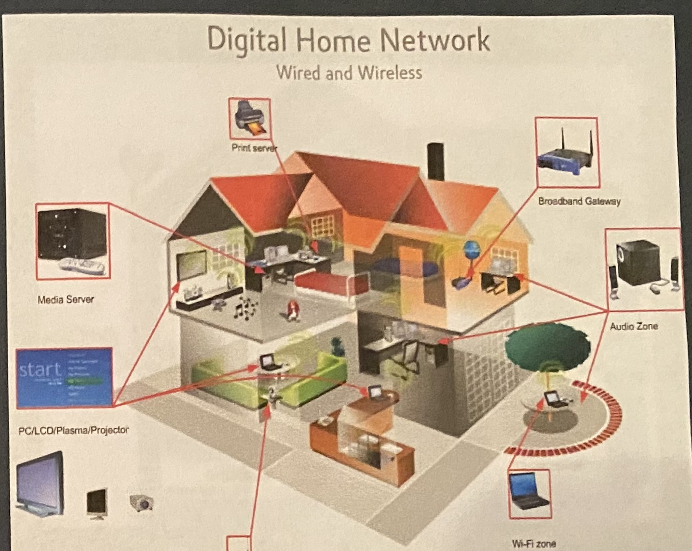
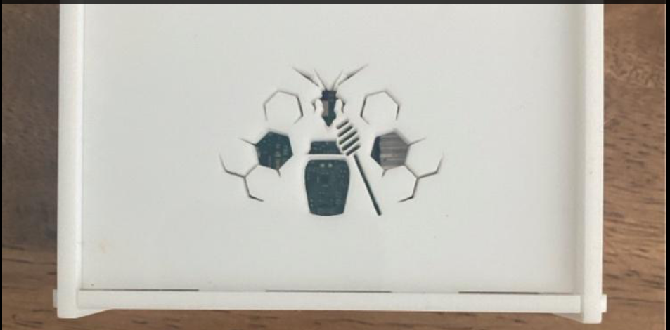
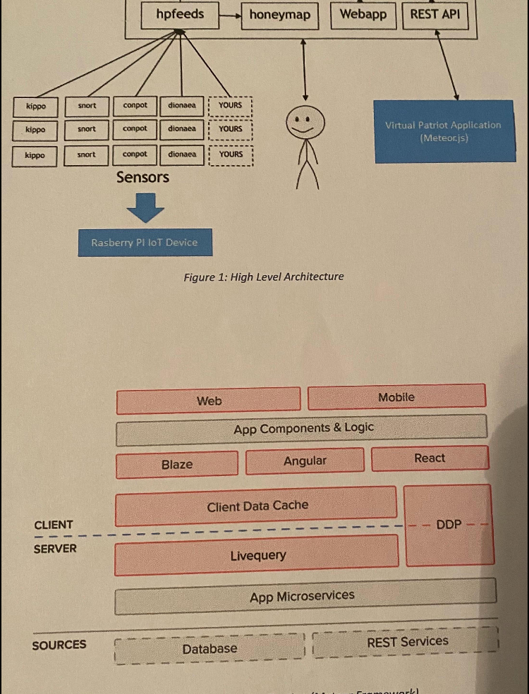
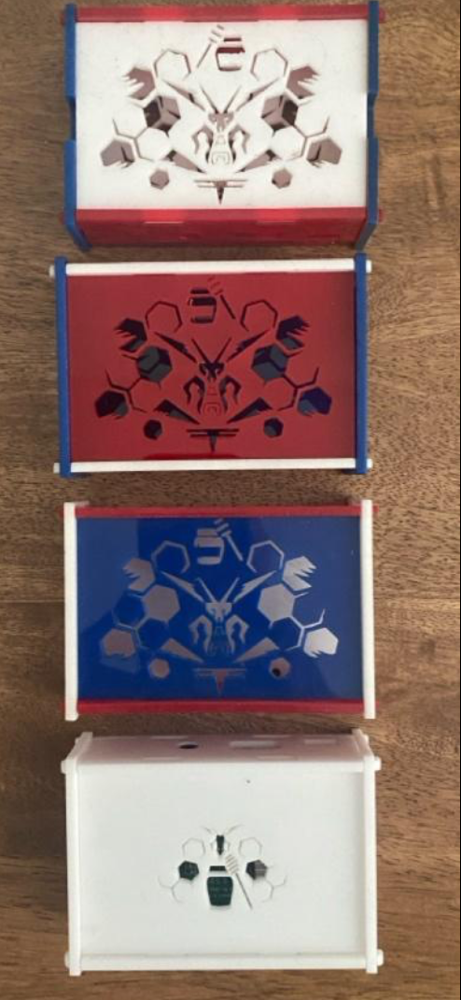

# Virtual Patriot

> **Status:** Historical prototype documentation with a future-facing **Cloud 2.0 concept**. This repository is a portfolio record, not a deployed cybersecurity product, active threat-intelligence service, or current consumer security offering.

*Historical network-concept illustration from owner-supplied presentation material. It depicts connected home endpoints and a broadband gateway; it is not a current device photograph, production architecture, or deployed service diagram.*

## Overview

Virtual Patriot is a retrospective portfolio entry for an early cybersecurity and systems-visualization concept associated with Clint Hill. Owner-provided historical context describes an exploration from approximately 2015 that considered a Raspberry Pi–based edge-device form factor alongside a human-readable interface for connected-home and network-security context.

The core idea was practical: connected environments contain many endpoints, such as gateways, media equipment, workstations, wireless devices, and sensor sources. The historical concept explored how a local device, telemetry inputs, and a supporting interface might make that environment easier to understand, organize, and investigate. It is preserved here as evidence of early **IoT, edge-device, network-visualization, and systems-design thinking**—not as evidence of a production-ready security control.

| Design lens | Historical concept recorded here | Scope boundary |
|---|---|---|
| Edge / IoT form factor | Owner-supplied materials reference a Raspberry Pi–based device concept and physical prototype cases. | Exact hardware configuration and implementation are not verified in this repository. |
| Honeypot-oriented context | Owner-supplied historical description references a honeypot device and a dashboard intended to provide activity context. | This repository does not establish live operation, data collection, detection efficacy, or geographic reporting capability. |
| Connected-home context | The selected illustration shows a gateway and multiple wired/wireless endpoints. | It is a historical concept illustration, not a current deployment diagram. |
| Human-readable visualization | Historical materials show an interest in making complex network context easier to interpret. | No claim is made about live monitoring, automated mitigation, or current product availability. |
| Cloud 2.0 | A future concept direction for decision-support-oriented views. | Concept only; it is not a deployed product or roadmap commitment. |

## Selected Historical Evidence

*Second-version MVP case, from owner-supplied historical material. This visual documents a physical prototype enclosure and front-panel identity treatment; it does not establish the internal hardware configuration or operational status.*

*Historical architecture illustration. Visible labels include a Raspberry Pi IoT device, sensor sources, hpfeeds, honeymap, web application and REST API components, plus a Meteor.js application. It is preserved as period design documentation rather than a current production architecture.*

*Owner-supplied record of multiple physical enclosure variants. It documents iteration in the prototype case presentation; it does not establish manufacturing volume, field deployment, or final production specifications.*

## Historical IoT and Systems Concept

The retained materials frame Virtual Patriot around three durable systems questions:

1. **What is connected?** A home or small-business environment includes a mix of gateways, media devices, personal endpoints, wireless equipment, and telemetry sources.
2. **How can the environment be understood?** A diagram, endpoint context, and a simple interface can turn a complex collection of devices into a comprehensible operating picture.
3. **How might a small edge device contribute?** The historical concept considered a modest local appliance as a possible organizing point for connected-environment context and sensor-oriented information flow.

The architecture illustration records a period-specific attempt to connect sensor sources with a user-facing application layer. It should be read as **historical systems thinking**: an exploration of how edge devices, feeds, web interfaces, and API boundaries might work together. It is not a claim that the depicted stack remains current, deployed, or production-ready.

## Cloud 2.0 Concept Direction

Cloud 2.0 retains the original design ambition: make complex technical context more understandable for human decision-makers. A future concept could explore risk-oriented summaries, event context, prioritization, and recommended next actions. These are **conceptual directions only** and should not be treated as confirmed product capabilities.

## Clint Hill’s Role

This repository documents Clint Hill’s historical concept, prototype presentation work, and portfolio narrative. The public record is intentionally conservative: details about final hardware configuration, software stack, data sources, detection logic, deployment history, team involvement, and quantitative outcomes will be added only when supported by archived project materials.

## Timeline

| Period | Milestone | Evidence status |
|---|---|---|
| Circa 2015 | Historical prototype exploration, according to owner-provided project context. | Supporting presentation materials, physical-case photographs, a systems architecture illustration, and a historical network-concept illustration are retained. |
| 2026 | Portfolio documentation refined from retained owner-supplied materials. | Public wording and visuals deliberately distinguish historical evidence from current capability. |
| Future | Cloud 2.0 concept exploration. | Concept only; no production-readiness claim. |

## Portfolio-Use and Security Notice

This repository intentionally excludes source code, credentials, IP addresses, production configurations, customer data, attack data, proprietary methods, and internal documents. The included diagrams and photographs are supplied solely as historical portfolio evidence. Any future visual that illustrates a proposed interface will be labeled **Concept Interface**.

---

**Portfolio owner:** Clint Hill  
**Related practice:** [PatternBridge Systems](https://patternbridgesystems.vip)
